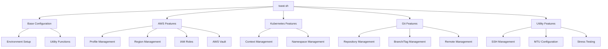
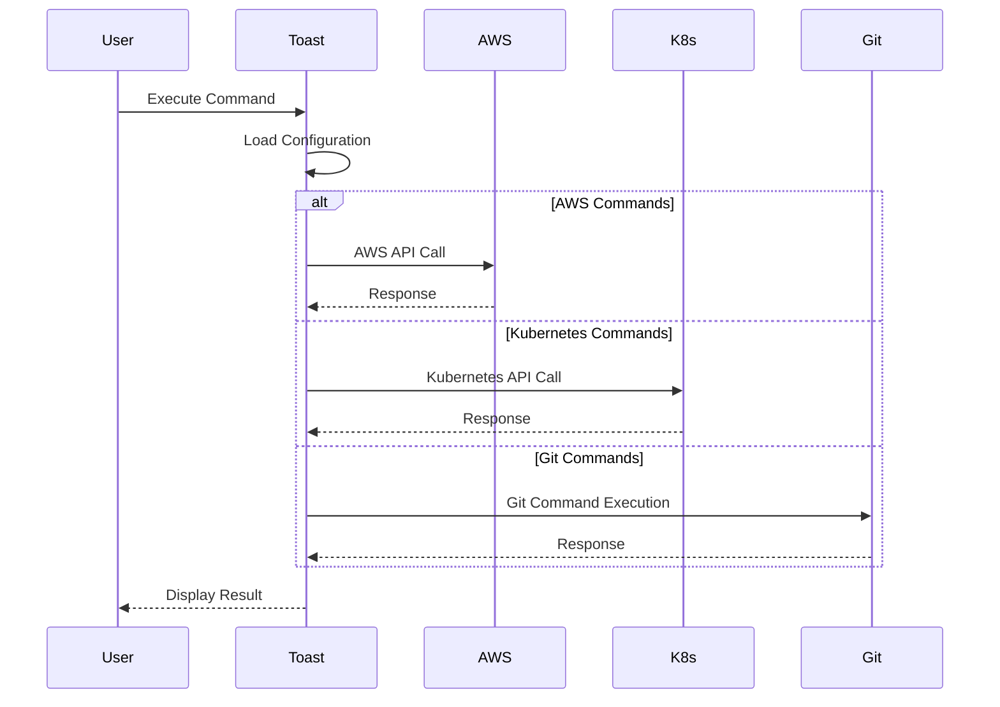

# Architecture

This document describes the architecture and main components of the toast.sh project.

## Overall Structure



## Main Components

### 1. Base Configuration (`_prepare`, `_save`)
- Environment initialization
- Configuration file management
- Cross-platform support (Linux/macOS)

### 2. AWS Features
- Profile Management (`_env`)
  * AWS credential configuration
  * MFA authentication support
- Region Management (`_region`)
  * AWS region switching and configuration
- IAM Roles (`_assume`)
  * Role switching and temporary credential management
- AWS Vault Support (`_av`)
  * AWS Vault integration

### 3. Kubernetes Features
- Context Management (`_ctx`)
  * EKS cluster management
  * Context switching
- Namespace Management (`_ns`)
  * Namespace switching
  * Namespace listing

### 4. Git Features
- Repository Management (`git_clone`, `git_rm`)
  * Repository cloning
  * Repository deletion
- Branch/Tag Management (`git_branch`, `git_tag`)
  * Branch creation/switching
  * Tag management
- Remote Management (`git_remote`)
  * Remote repository addition/removal
  * Remote synchronization

### 5. Utility Features
- SSH Management (`_ssh`)
  * SSH key management
  * Connection history tracking
- MTU Configuration (`_mtu`)
  * Network MTU settings
- Stress Testing (`_stress`)
  * Server load testing

## Data Flow



## Configuration File Structure

### ~/.toast/toast.sh
```bash
ENV_DIR=/path/to/env    # AWS environment configuration directory
PEM_DIR=/path/to/pem    # SSH key directory
ROLE_DIR=/path/to/role  # AWS role directory
SRC_DIR=/path/to/src    # Source code directory
```

## Security Considerations

1. AWS Credential Management
   - Credential file permissions (600)
   - MFA authentication support
   - AWS Vault integration

2. SSH Key Management
   - Key file permissions (600)
   - Connection history tracking

3. Kubernetes Authentication
   - kubeconfig file permissions
   - Context isolation

## Future Improvements

1. Test Automation
   - Add unit tests
   - Add integration tests

2. Documentation Enhancement
   - Add function-level comments
   - Add usage examples

3. Feature Improvements
   - Enhance error handling
   - Add logging functionality
   - Implement plugin system
