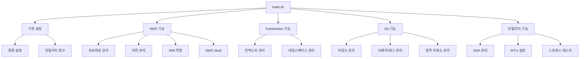
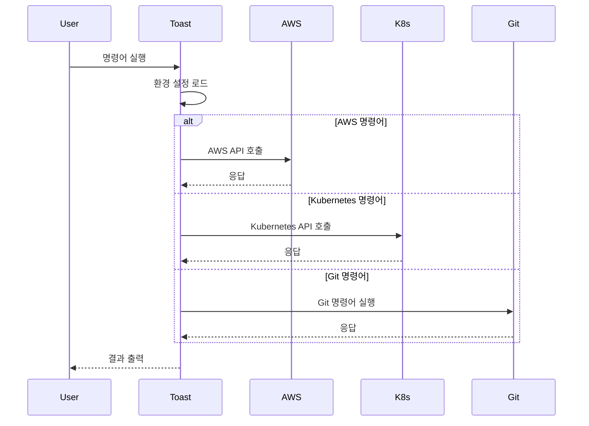

# Architecture

이 문서는 toast.sh 프로젝트의 아키텍처와 주요 컴포넌트들을 설명합니다.

## 전체 구조



## 주요 컴포넌트

### 1. 기본 설정 (`_prepare`, `_save`)
- 환경 설정 초기화
- 설정 파일 관리
- 크로스 플랫폼 지원 (Linux/macOS)

### 2. AWS 기능
- 프로파일 관리 (`_env`)
  * AWS 자격 증명 설정
  * MFA 인증 지원
- 리전 관리 (`_region`)
  * AWS 리전 변경 및 설정
- IAM 역할 (`_assume`)
  * 역할 전환 및 임시 자격 증명 관리
- AWS Vault 지원 (`_av`)
  * AWS Vault 통합

### 3. Kubernetes 기능
- 컨텍스트 관리 (`_ctx`)
  * EKS 클러스터 관리
  * 컨텍스트 전환
- 네임스페이스 관리 (`_ns`)
  * 네임스페이스 전환
  * 네임스페이스 목록 조회

### 4. Git 기능
- 저장소 관리 (`git_clone`, `git_rm`)
  * 저장소 클론
  * 저장소 삭제
- 브랜치/태그 관리 (`git_branch`, `git_tag`)
  * 브랜치 생성/전환
  * 태그 관리
- 원격 저장소 관리 (`git_remote`)
  * 원격 저장소 추가/삭제
  * 원격 저장소 동기화

### 5. 유틸리티 기능
- SSH 관리 (`_ssh`)
  * SSH 키 관리
  * 접속 이력 관리
- MTU 설정 (`_mtu`)
  * 네트워크 MTU 설정
- 스트레스 테스트 (`_stress`)
  * 서버 부하 테스트

## 데이터 흐름



## 설정 파일 구조

### ~/.toast/toast.sh
```bash
ENV_DIR=/path/to/env    # AWS 환경 설정 디렉토리
PEM_DIR=/path/to/pem    # SSH 키 디렉토리
ROLE_DIR=/path/to/role  # AWS 역할 디렉토리
SRC_DIR=/path/to/src    # 소스 코드 디렉토리
```

## 보안 고려사항

1. AWS 자격 증명 관리
   - 자격 증명 파일 권한 설정 (600)
   - MFA 인증 지원
   - AWS Vault 통합

2. SSH 키 관리
   - 키 파일 권한 설정 (600)
   - 접속 이력 관리

3. Kubernetes 인증
   - kubeconfig 파일 권한 설정
   - 컨텍스트 분리

## 향후 개선 사항

1. 테스트 자동화
   - 단위 테스트 추가
   - 통합 테스트 추가

2. 문서화 개선
   - 함수별 주석 추가
   - 사용 예제 추가

3. 기능 개선
   - 에러 처리 강화
   - 로깅 기능 추가
   - 플러그인 시스템 도입
